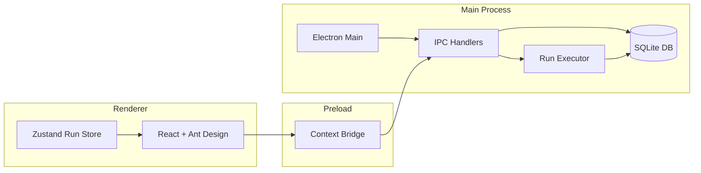

# Architecture

BuildRunner follows an Electron-based three-process model with a strict separation between data persistence, system capabilities, and UI rendering.

## Process boundaries

- **Main process** hosts the SQLite-backed data access layer, the configurable run queue, and IPC handlers that expose a minimal, typed API to the renderer.
- **Preload** is sandboxed and exposes a curated `window.api` bridge that mirrors the IPC contracts defined in `@shared`.
- **Renderer** (React + Vite) focuses on user experience, fetching data through the bridge and managing transient UI state with Zustand.

## Data flow

1. Renderer requests resources (commands, files, history) via `window.api`.
2. IPC handlers delegate to the `DataStore`, which issues synchronous SQL queries via `better-sqlite3`.
3. When the user executes a command, the renderer invokes `run.execute`. The main process enqueues the job, persists a `run_history` record, and streams stdout/stderr back through IPC progress events.
4. Run completion updates both `run_history` and the `file_command_args` status, enabling dashboards and history tables to stay in sync.

## Persistence schema

- `commands` – catalog of executable definitions and argument schemas.
- `files` – managed file entries with tags and creation metadata.
- `file_command_args` – per-file overrides, last run state, and status.
- `run_history` – immutable log of every execution with stdout/stderr payloads.

## Security highlights

- Context isolation, sandboxed renderer, and a strict Content Security Policy.
- No `nodeIntegration`; all privileged capabilities are funneled through a typed preload bridge.
- Executable validation and platform-specific spawning logic in the main process prevent command injection.

## Build pipeline

- `tsup` bundles the main and preload processes (ESM output with sourcemaps).
- `vite` handles the React renderer with fast HMR in development.
- `electron-builder` packages platform-specific binaries, copying the native `better-sqlite3` artifacts automatically.
